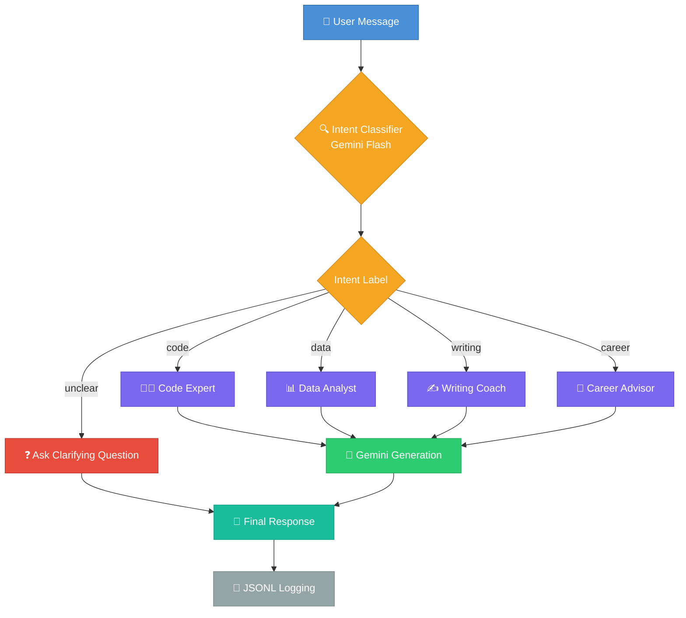

# AI Prompt Router Service

## Overview

AI Prompt Router is a backend service that intelligently routes user queries to specialized AI personas.
Instead of using a single generic prompt, the system first detects the user's **intent** and then delegates the request to an **expert prompt** designed for that task.

This architecture improves response quality, reduces cost, and enables scalable AI applications.

The service is built using **Python, FastAPI, and Docker**, and uses **Google Gemini models** for both classification and response generation.

---

## Architecture

The system follows a **two-stage LLM pipeline**:

1. **Intent Classification** — A lightweight LLM call detects the user's intent.
2. **Expert Response Generation** — The classified intent selects a specialized persona prompt for a second, detailed LLM call.



---

## Features

- Intent-based prompt routing
- Four specialized AI personas
- Structured JSON responses
- Confidence-based routing
- Manual intent override
- Request logging
- FastAPI REST service
- Dockerized deployment
- Swagger API documentation

---

## Expert Personas

The system includes four specialized prompts:

| Intent    | Persona                     |
| --------- | --------------------------- |
| `code`    | Software Engineering Expert |
| `data`    | Data Analyst                |
| `writing` | Writing Coach               |
| `career`  | Career Advisor              |

Each persona is designed with a focused prompt to produce domain-specific responses.

---

## API Endpoint

### POST `/chat`

Process a user message and return an AI-generated response.

#### Request

```json
{
  "message": "How do I sort a list in Python?"
}
```

#### Response

```json
{
  "intent": "code",
  "confidence": 0.98,
  "response": "..."
}
```

---

## Manual Intent Override

Users can bypass the classifier by prefixing the message:

```
@code fix this bug
@writing improve this paragraph
@career what should I do after college
```

This forces the router to use the selected expert persona.

---

## Logging

Every request is stored in:

```
route_log.jsonl
```

Example entry:

```json
{
  "intent": "code",
  "confidence": 0.98,
  "user_message": "How do I sort a list?",
  "response": "..."
}
```

This enables monitoring, debugging, and analytics.

---

## Running the Service

### 1. Clone the Repository

```
git clone <repo-url>
cd ai_router
```

---

### 2. Create Environment File

Create `.env`

```
GEMINI_API_KEY=your_api_key
```

---

### 3. Run With Docker

```
docker compose up
```

The API will start at:

```
http://localhost:8000
```

---

### API Documentation

FastAPI automatically generates Swagger docs:

```
http://localhost:8000/docs
```

---

## Example API Call

Using curl:

```
curl -X POST "http://localhost:8000/chat" \
-H "Content-Type: application/json" \
-d '{"message":"How do I sort a list in Python?"}'
```

---

## Running Tests

The project includes unit tests using Python's `unittest` module with mocked LLM calls:

```
python -m pytest test_prompts.py test_classifier.py test_classifier_intent.py test_router.py -v
```

Or run all tests at once:

```
python -m pytest -v
```

---

## Project Structure

```
ai_router/
│
├── api.py
├── classifier.py
├── router.py
├── prompts.py
├── logger.py
├── main.py
│
├── test_prompts.py
├── test_classifier.py
├── test_classifier_intent.py
├── test_router.py
│
├── route_log.jsonl
├── .env
├── .env.example
├── .gitignore
│
├── Dockerfile
├── docker-compose.yml
├── requirements.txt
└── README.md
```

---

## Tech Stack

- Python
- FastAPI
- Google Gemini API
- Docker
- JSONL Logging

---

## Future Improvements

- Rate limiting
- Request caching
- Multi-intent detection
- Background task queue
- Monitoring dashboard

---

## License

MIT License
